# The Flow of Data Through Refinery

## High-Level Data Flow

```mermaid
flowchart TB
    subgraph Ingestion["📥 Ingestion Layer"]
        HTTP["HTTP Endpoints<br/>/1/event, /1/batch<br/>/v1/traces, /v1/logs"]
        GRPC["gRPC Endpoints<br/>OTLP TraceService"]
        PeerIn["Peer Incoming<br/>(from other Refinery nodes)"]
    end

    subgraph Router["🔀 Router (route.go)"]
        Decompress["Decompress<br/>(gzip/zstd)"]
        Unmarshal["Unmarshal<br/>(JSON/msgpack/protobuf)"]
        Extract["Extract Metadata<br/>(API key, dataset, trace ID)"]
        HasTraceID{"Has TraceID?"}
        StressCheck{"Stressed?"}
        ShardCheck{"My Shard?"}
        RouterType{"Router Type?"}
    end

    subgraph Collector["📦 InMemCollector"]
        WorkerHash["Hash TraceID<br/>to Worker"]

        subgraph Workers["👷 CollectorWorkers (parallel)"]
            Worker0["Worker 0"]
            Worker1["Worker 1"]
            WorkerN["Worker N..."]
        end

        TracesToSend(["tracesToSend"])
        SendTraces["sendTraces()"]
    end

    subgraph StressRelief["⚡ Stress Relief"]
        ImmediateDecision["ProcessSpanImmediately()<br/>(deterministic sampling)"]
        WorkerSentCache["Worker's Sent Cache<br/>(record decision)"]
        ProbeCheck{"My Shard?"}
    end

    subgraph Transmission["📤 Transmission Layer"]
        DecorateSpans["Decorate Spans<br/>(sample rate, metadata)"]
        Batch["Batch by Destination"]
        UpstreamTX["Upstream Transmission"]
        PeerTX["Peer Transmission"]
    end

    subgraph Destinations["🎯 Destinations"]
        Honeycomb["Honeycomb API"]
        PeerNodes["Peer Refinery Nodes"]
    end

    %% Ingestion flow
    HTTP --> Decompress
    GRPC --> Decompress
    PeerIn --> Decompress
    Decompress --> Unmarshal
    Unmarshal --> Extract
    Extract --> HasTraceID

    %% No trace ID - direct upstream
    HasTraceID -->|"No"| UpstreamTX

    %% Has trace ID - check stress
    HasTraceID -->|"Yes"| StressCheck

    %% Stress relief path
    StressCheck -->|"Yes"| ImmediateDecision
    ImmediateDecision --> WorkerSentCache
    WorkerSentCache -->|"dropped"| Drop1["Drop"]
    WorkerSentCache -->|"kept"| UpstreamTX
    WorkerSentCache -->|"kept"| ProbeCheck
    ProbeCheck -->|"different peer"| PeerTX
    ProbeCheck -->|"my shard"| Drop2["Done"]

    %% Normal path
    StressCheck -->|"No"| ShardCheck
    ShardCheck -->|"different peer"| PeerTX
    ShardCheck -->|"my shard"| RouterType

    RouterType -->|"IncomingRouter"| WorkerHash
    RouterType -->|"PeerRouter"| WorkerHash

    %% Hash to workers via per-worker channels
    WorkerHash -->|"worker ch"| Worker0
    WorkerHash -->|"worker ch"| Worker1
    WorkerHash -->|"worker ch"| WorkerN

    %% Workers output
    Worker0 --> TracesToSend
    Worker1 --> TracesToSend
    WorkerN --> TracesToSend
    TracesToSend --> SendTraces

    %% Transmission
    SendTraces --> DecorateSpans
    DecorateSpans --> Batch
    Batch --> UpstreamTX

    %% Destinations
    UpstreamTX --> Honeycomb
    PeerTX --> PeerNodes
```

## Worker Internals

```mermaid
flowchart TB
    subgraph Inputs["📥 Input Channels"]
        FromPeer(["telemetry from peers (priority)"])
        Incoming(["incoming telemetry from clients"])
        Ticker((("ticker<br/>(periodic)")))
        SendEarly{{"sendEarly<br/>(memory pressure)"}}
    end

    subgraph CollectLoop["🔄 collect() loop"]
        Select{"select"}
        ProcessSpan["processSpan()"]
        SendExpired["sendExpiredTracesInCache()"]
        SendTracesEarly["sendTracesEarly()"]
    end

    subgraph Caches["💾 Caches"]
        TraceCache["Trace Cache<br/>(active traces)"]
        SentCache["Sent Cache<br/>(decisions)"]
    end

    subgraph Triggers["⏰ Decision Triggers"]
        TriggerRoot["TraceSendGotRoot<br/>(root span arrived)"]
        TriggerLimit["TraceSendSpanLimit<br/>(span limit exceeded)"]
        TriggerExpired["TraceSendExpired<br/>(trace timeout)"]
        TriggerMemory["TraceSendEjectedMemsize<br/>(memory eviction)"]
    end

    subgraph Sampling["🎯 Sampling"]
        GetSampler["Get Sampler<br/>for dataset/env"]
        Samplers["Samplers:<br/>• Deterministic<br/>• Dynamic/EMA<br/>• Rules-based<br/>• Throughput"]
        MakeDecision["makeDecision()<br/>rate, keep, reason"]
    end

    Send["Send"]
    Drop["Drop"]

    %% Input to select
    Incoming --> Select
    FromPeer --> Select
    Ticker --> Select
    SendEarly --> Select

    %% Select dispatches
    Select -->|"span"| ProcessSpan
    Select -->|"tick"| SendExpired
    Select -->|"memory pressure"| SendTracesEarly

    %% ProcessSpan flow
    ProcessSpan -->|"check/add"| TraceCache
    ProcessSpan -->|"cache miss or<br/>trace.Sent?"| SentCache

    %% Late span handling from SentCache
    SentCache -->|"late span kept"| Send
    SentCache -->|"late span dropped"| Drop

    %% Expiration checks cache
    SendExpired --> TraceCache
    SendTracesEarly --> TraceCache

    %% Cache triggers decisions
    TraceCache -->|"root arrived"| TriggerRoot
    TraceCache -->|"span limit"| TriggerLimit
    TraceCache -->|"timeout"| TriggerExpired
    TraceCache -->|"eviction"| TriggerMemory

    %% Triggers to sampling
    TriggerRoot --> GetSampler
    TriggerLimit --> GetSampler
    TriggerExpired --> GetSampler
    TriggerMemory --> GetSampler

    %% Sampling flow
    GetSampler --> Samplers
    Samplers --> MakeDecision
    MakeDecision -->|"record decision"| SentCache
    MakeDecision -->|"kept"| Send
    MakeDecision -->|"dropped"| Drop
```

## Key Data Flow Summary

| Stage | Component | Description |
|-------|-----------|-------------|
| **Ingestion** | `route/route.go` | HTTP/gRPC endpoints receive spans, decompress, and unmarshal |
| **Routing** | `route/route.go:689-803` | Decides: direct send (no trace ID), stress relief, peer forward, or collect |
| **Collection** | `collect/collect.go` | Manager routes spans to workers based on trace ID hash |
| **Workers** | `collect/collector_worker.go` | Parallel workers assemble traces and make sampling decisions |
| **Transmission** | `transmit/direct_transmit.go` | Batches and sends kept spans to Honeycomb |

## Multi-Worker Architecture

The InMemCollector uses multiple parallel `CollectorWorker` instances:

| Component | Description |
|-----------|-------------|
| **InMemCollector** | Manager that routes spans and coordinates workers |
| **CollectorWorker** | Independent worker with own cache, channels, and collect loop |
| **Worker Assignment** | `hash(traceID) % numWorkers` ensures all spans for a trace go to same worker |

Each worker has:

- **incoming channel** - spans from external clients (via `AddSpan()`)
- **fromPeer channel** - spans from peer Refinery nodes (via `AddSpanFromPeer()`)
- **Trace Cache** - assembles spans into traces
- **Sent Cache** - records sampling decisions for late-arriving spans
- **collect() loop** - processes spans, makes decisions, sends to `tracesToSend`

## Two Router Instances

Refinery runs two separate Router instances that share the same processing logic:

| Router             | Listens On        | Source               | Collector Method                                  |
|--------------------|-------------------|----------------------|-----------------------------------------------    |
| **IncomingRouter** | `ListenAddr`      | External clients     | `AddSpan()` → worker's `incoming` channel         |
| **PeerRouter**     | `PeerListenAddr`  | Other Refinery nodes | `AddSpanFromPeer()` → worker's `fromPeer` channel |

Both routers go through the same flow (decompress → unmarshal → extract → stress check → shard check), then the InMemCollector hashes the trace ID to select a worker.

## Stress Relief

When stressed, `ProcessSpanImmediately()` makes an immediate deterministic decision:

- **Kept spans** are sent directly upstream (bypassing the collector entirely)
- A **probe** is forwarded to the owning peer if it's a different shard (to inform them of the decision)
- **Dropped spans** are discarded immediately

Stress relief completely bypasses the workers to reduce memory pressure.

## Sent Cache Architecture

Each `CollectorWorker` has its own `sampleCache` that records sampling decisions for traces it owns. This cache is used for:

- **Normal operation** - recording decisions made by the worker's sampling logic
- **Stress relief** - `ProcessSpanImmediately()` looks up the owning worker via `hash(traceID) % numWorkers` and records the decision in that worker's `sampleCache`

This design ensures that late-arriving spans for a trace will always be routed to the same worker that made (or will make) the sampling decision, so the decision can be found in that worker's sent cache.

## Decision Triggers

Within each worker's `collect()` loop, traces are sent for sampling decision based on these triggers:

| Trigger                      | Metric / `meta.refinery.send_reason` | Condition                                          |
|------------------------------|--------------------------------------|----------------------------------------------------|
| **TraceSendGotRoot**         | `trace_send_got_root`                | Root span arrived, trace ready after SendDelay     |
| **TraceSendSpanLimit**       | `trace_send_span_limit`              | Trace exceeded configured SpanLimit                |
| **TraceSendExpired**         | `trace_send_expired`                 | Trace timeout (TraceTimeout) reached without root  |
| **TraceSendEjectedMemsize**  | `trace_send_ejected_memsize`         | Memory pressure triggered coordinated eviction     |

The `collect()` loop processes these via:

- **processSpan()** - adds spans to cache, marks trace for sending if root or limit hit
- **sendExpiredTracesInCache()** - called on ticker, finds traces past SendBy time
- **sendTracesEarly()** - called when memory monitor signals eviction needed
