# The Flow of Data Through Refinery

```mermaid
flowchart TB
    subgraph Ingestion["📥 Ingestion Layer"]
        HTTP["HTTP Endpoints<br/>/1/event, /1/batch<br/>/v1/traces, /v1/logs"]
        GRPC["gRPC Endpoints<br/>OTLP TraceService"]
        PeerIn["Peer Incoming<br/>(from other Refinery nodes)"]
    end

    subgraph Router["🔀 Router (route.go)"]
        Decompress["Decompress<br/>(gzip/zstd)"]
        Unmarshal["Unmarshal<br/>(JSON/msgpack/protobuf)"]
        Extract["Extract Metadata<br/>(API key, dataset, trace ID)"]
        HasTraceID{"Has TraceID?"}
        StressCheck{"Stressed?"}
        ShardCheck{"My Shard?"}
        RouterType{"Router Type?"}
    end

    subgraph Collector["📦 InMemCollector (collect.go)"]
        IncomingQueue["incoming channel<br/>(buffered)"]
        PeerQueue["fromPeer channel<br/>(buffered)"]
        CollectLoop["Single-threaded<br/>collect() loop"]
        TraceCache["Trace Cache<br/>(InMemCache)"]
        SentCache["Sent Cache<br/>(CuckooSentCache)"]
    end

    subgraph Sampling["🎯 Sampling Decision"]
        GetSampler["Get Sampler<br/>for dataset/env"]
        Samplers["Samplers:<br/>• Deterministic<br/>• Dynamic/EMA<br/>• Rules-based<br/>• Throughput"]
        MakeDecision["makeDecision()<br/>rate, keep, reason"]
    end

    subgraph Transmission["📤 Transmission Layer"]
        DecorateSpans["Decorate Spans<br/>(sample rate, metadata)"]
        Batch["Batch by Destination<br/>(apiHost + apiKey + dataset)"]
        Serialize["Serialize (msgpack)<br/>Compress (zstd)"]
        UpstreamTX["Upstream<br/>Transmission"]
        PeerTX["Peer<br/>Transmission"]
    end

    subgraph Destinations["🎯 Destinations"]
        Honeycomb["Honeycomb API"]
        PeerNodes["Peer Refinery Nodes"]
    end

    subgraph StressRelief["⚡ Stress Relief"]
        ImmediateDecision["ProcessSpanImmediately()<br/>(deterministic sampling)"]
        ProbeCheck{"My Shard?"}
    end

    %% Ingestion flow - all sources go through same router flow
    HTTP --> Decompress
    GRPC --> Decompress
    PeerIn --> Decompress
    Decompress --> Unmarshal
    Unmarshal --> Extract
    Extract --> HasTraceID

    %% No trace ID - direct upstream
    HasTraceID -->|"No"| UpstreamTX

    %% Has trace ID - check stress
    HasTraceID -->|"Yes"| StressCheck

    %% Stress relief path - bypasses collector entirely
    StressCheck -->|"Yes"| ImmediateDecision
    ImmediateDecision -->|"kept → send upstream"| UpstreamTX
    ImmediateDecision -->|"kept → probe"| ProbeCheck
    ImmediateDecision -->|"dropped"| Drop1["Drop"]
    ProbeCheck -->|"No - notify peer"| PeerTX
    ProbeCheck -->|"Yes - done"| Drop2["Done"]

    %% Normal path - check shard ownership
    StressCheck -->|"No"| ShardCheck
    ShardCheck -->|"No - different peer"| PeerTX
    ShardCheck -->|"Yes - mine"| RouterType

    %% Router type determines which queue
    RouterType -->|"IncomingRouter<br/>AddSpan()"| IncomingQueue
    RouterType -->|"PeerRouter<br/>AddSpanFromPeer()"| PeerQueue

    %% Collection
    IncomingQueue --> CollectLoop
    PeerQueue --> CollectLoop
    CollectLoop --> TraceCache

    %% Sampling trigger
    TraceCache -->|"root arrived /<br/>timeout / limit"| GetSampler
    GetSampler --> Samplers
    Samplers --> MakeDecision

    %% Decision handling
    MakeDecision -->|"record"| SentCache

    %% Transmission
    MakeDecision -->|"kept"| DecorateSpans
    DecorateSpans --> Batch
    Batch --> Serialize
    Serialize --> UpstreamTX

    %% Destinations
    UpstreamTX --> Honeycomb
    PeerTX --> PeerNodes

    %% Late spans
    SentCache -.->|"late span<br/>lookup"| CollectLoop

    %% Styling
    classDef ingress fill:#e1f5fe,stroke:#01579b
    classDef router fill:#fff3e0,stroke:#e65100
    classDef collector fill:#f3e5f5,stroke:#7b1fa2
    classDef sampling fill:#e8f5e9,stroke:#2e7d32
    classDef transmit fill:#fce4ec,stroke:#c2185b
    classDef dest fill:#e0f2f1,stroke:#00695c
    classDef stress fill:#ffebee,stroke:#b71c1c
    classDef drop fill:#efebe9,stroke:#5d4037

    class HTTP,GRPC,PeerIn ingress
    class Decompress,Unmarshal,Extract,HasTraceID,ShardCheck,StressCheck,RouterType router
    class IncomingQueue,PeerQueue,CollectLoop,TraceCache,SentCache collector
    class GetSampler,Samplers,MakeDecision sampling
    class DecorateSpans,Batch,Serialize,UpstreamTX,PeerTX transmit
    class Honeycomb,PeerNodes dest
    class ImmediateDecision,ProbeCheck stress
    class Drop1,Drop2 drop
```

## Key Data Flow Summary

| Stage | Component | Description |
|-------|-----------|-------------|
| **Ingestion** | `route/route.go` | HTTP/gRPC endpoints receive spans, decompress, and unmarshal |
| **Routing** | `route/route.go:689-803` | Decides: direct send (no trace ID), stress relief, peer forward, or collect |
| **Collection** | `collect/collect.go` | Single-threaded collector assembles traces from spans |
| **Sampling** | `sample/` | Evaluates complete traces using configured samplers |
| **Transmission** | `transmit/direct_transmit.go` | Batches and sends kept spans to Honeycomb |

## Two Router Instances

Refinery runs two separate Router instances that share the same processing logic:

| Router | Listens On | Source | Collector Method |
|--------|------------|--------|------------------|
| **IncomingRouter** | `ListenAddr` | External clients | `AddSpan()` → `incoming` channel |
| **PeerRouter** | `PeerListenAddr` | Other Refinery nodes | `AddSpanFromPeer()` → `fromPeer` channel |

Both routers go through the same flow (decompress → unmarshal → extract → stress check → shard check), but spans are queued to different channels based on their source.

## Router Peer Forwarding

The **Router** determines shard ownership for each span:

| Condition | Action |
|-----------|--------|
| Span belongs to **this** shard | `Collector.AddSpan()` or `AddSpanFromPeer()` - local processing |
| Span belongs to **different** shard | `PeerTransmission.EnqueueEvent()` - forward directly, bypasses local collector |

Spans destined for other peers never enter the local InMemCollector - they are forwarded immediately at the routing layer.

## Stress Relief

When stressed, `ProcessSpanImmediately()` makes an immediate deterministic decision:

- **Kept spans** are sent directly upstream (bypassing the collector entirely)
- A **probe** is forwarded to the owning peer if it's a different shard (to inform them of the decision)
- **Dropped spans** are discarded immediately

Stress relief completely bypasses the InMemCollector to reduce memory pressure.

## Decision Triggers

Traces are sent for sampling decision when:

1. Root span arrives
2. Span limit exceeded
3. Trace timeout reached
4. Memory pressure
